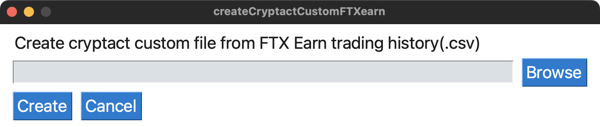

# createCryptactCustomFTXearn
FTX Japanの取引履歴(FTX Earn)のcsvファイルから、クリプタクトカスタムファイル(Staking)を作成するGUIアプリケーション

[](https://www.python.org/downloads/) [](https://pypi.org/project/PySimpleGUI/4.60.3/) [](https://pypi.org/project/pandas/1.4.4/) [](https://github.com/opensource-jp/licenses/blob/main/MIT/MIT.md) 

## GUI


## 実行環境
動作確認済みの環境は以下です。他のバージョン(下記バージョン以下)でも動作すると思いますが、未確認です。実行する際は自己責任でお願いします。
* Windows 11 / macOS Monterey(version 12.6)
* Python 3.10.6
* PySimpleGUI==4.60.3
* pandas==1.4.4

## 使い方
### 1. パッケージインストール
venvやpyenv等で仮想環境を作成して下記コマンドを実行してください。
```
% pip install PySimpleGUI
% pip install pandas
```

### 2. 要ユーザー設定項目作成
ソースコード記載の[ 要ユーザー設定 ]部分を変更してください。

### 3. コマンド実行
```
% python create_cryptactcustom_ftxearn_gui.py
```

## 注意事項
* 本コードは暗号資産を対象とし、ユーザーの取引履歴に依存します。必ず実行後はカスタムファイルを確認し、期待するデータを作成できているかどうかを確認してください。本コードを実行したこと、参考にしたことによって被るあらゆる損害について責任を負いかねますのでご了承ください。
* 読込み対象ファイルはFTX Earnの取引履歴(CSV)です。対象以外のファイルはエラーとし、プログラムを終了します。
* 2022/09/19現在、FTX Japanの取引履歴(FTX Earn)は取引レポートページからCSVファイルの取得に対応していませんが、サポートチケット経由で手動取得を依頼することができますので、確認の上、CSVファイルを取得してください。
* 将来的にFTX Japanの取引レポート履歴とクリプタクトのデータフォーマットの仕様は変わる可能性がありますので、最新の情報を確認してください。
* ソースコードはMacBookPro 13inchに合わせて作成しています。データの取得処理に影響がないことは確認していますが、Windows他、スペックが毎なるケースではレイアウトが上記GUIと異なる可能性がありますのでご注意ください。